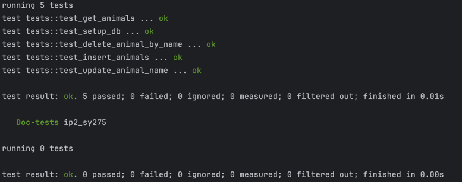
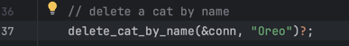
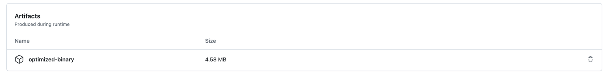

# Rust SQLite CLI

A simple Rust program demonstrating CRUD operations with an SQLite database.

## YouTube Video

Click the image below to watch the video:

## Rust Source Code Syntax and Unique Features

My codes demonstrate several unique features and idioms of Rust:

1. **Ownership and Borrowing**: Rust is known for its unique ownership system, which ensures memory safety without a garbage collector.
    - The use of `&` when passing arguments indicates borrowing. For example, `&Connection` means that the function borrows a reference to a `Connection` object.
    - The code also demonstrates how values can be moved, as with `String::from()` and the insertion into `HashMap`.

2. **Pattern Matching**: The `match` construct is used in the code for handling different command-line arguments. Pattern matching in Rust is exhaustive, meaning every possible case must be covered, ensuring safety.

3. **Error Handling**: Rust's `Result` type is used for error handling.
    - The `?` operator is used to propagate errors, making error handling concise and readable. If an operation returns an `Err`, the error is returned immediately from the function. Otherwise, the value inside the `Ok` variant is extracted.
    - Functions in the code have the return type `Result<()>` or `Result<Vec<Cat>>`, which means they return either an `Ok` value with the specified type or an error (`Err`).

4. **Immutability**: In Rust, variables are immutable by default. This means they can't be changed once they're set, promoting safer and more predictable code. In cases where mutability is necessary, the `mut` keyword is used, as seen in the declaration of the `stmt` variable.

5. **Option Type**: The `Option` type is used, which is an enum that can either be `Some(T)` or `None`. It's a way of handling nullable values without using null. The `.optional()` method from the `rusqlite` crate is used to handle possible null results from database queries.

6. **Type Inference**: Even though Rust is a statically typed language, you don't always have to annotate types, thanks to its type inference. For instance, when you create the `HashMap`, Rust knows the types of its keys and values based on the inserted values.

7. **Derive Attribute**: The `#[derive(Debug)]` attribute automatically implements the `Debug` trait for the `Cat` struct, allowing it to be printed in a debug format.

8. **Lifetimes and References**: Though not explicitly annotated in this code, Rust's borrowing mechanism relies on lifetimes to ensure references are always valid. This prevents dangling references.

9. **Closures**: The code uses closures with the `|row|` syntax when querying the database. Rust closures are a way to define inline functions that can capture their environment.

## How to Run

## Dependencies
- Rust & Cargo: [Install here](https://rustup.rs/)
- SQLite

### Preparation

1. Clone this repository.
2. Run `cargo clean` to clean old target files.
3. Run `cargo update` to update dependencies.
3. Run `cargo build` to build the project and install dependencies.

### Run Program of the SQLite Database

Here I choose a simple way to use the command line input. Nevertheless, it is safer than the direct input of the SQL statement since it can prevent `SQL injection`.

Meanwhile, Error handling is also implemented in the code. For example, if the user inputs a wrong command, the program will give a prompt to the user.
- The `?` operator is used to propagate errors, making error handling concise and readable. If an operation returns an `Err`, the error is returned immediately from the function. Otherwise, the value inside the `Ok` variant is extracted.
- Functions in the code have the return type `Result<()>` or `Result<Vec<Cat>>`, which means they return either an `Ok` value with the specified type or an error (`Err`).

> Any invalid input will be handled by the program and give a prompt to the user to re-enter the input.

Here are some examples of the command line input:

Insert - To insert cats, you can use:

`$ cargo run insert Tigger Blue`

Update - To update a cat's name:

`$ cargo run update Tigger TiggerUpdated`

Delete - To delete a cat by name:

`$ cargo run delete TiggerUpdated`

List - To list all cats:

`$ cargo run list`

## Test

`cargo test`

## Use of GitHub Copilot
Throughout the coding process, GitHub Copilot was utilized to suggest function implementations, improve code quality, and optimize performance.

For exampe:

Assume I want to write test case of delete function.

I just need to first write a comment about what I should do, then wait for a second, GitHub Copilot will give me a suggestion.

If I accept the suggestion, the code will be generated automatically by press `tab` on the keyboard.

The below image indicates this process, as you can see, the prompt is shown after the cursor.

After I press `tab`, the code will be generated automatically as below:

Furthermore, the rest code will be generated accordingly if needed.

## Optimized Rust Binary

The `release` mode is used to optimize the binary.

## References

* [rust-cli-template](https://github.com/kbknapp/rust-cli-template)
* [Rust-book](https://rust-lang-nursery.github.io/rust-cookbook/intro.html)
